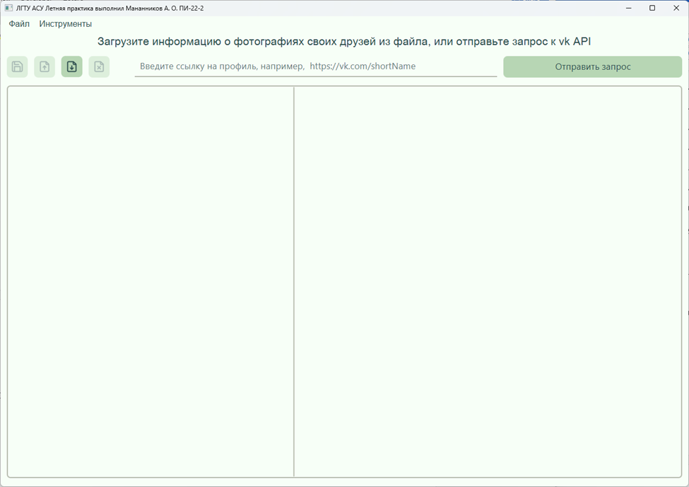

# Java JavaFX VK API photo fetcher

Мананников Антон Летняя практика в ЛГТУ, второй курс

## Описание (Description)

Простой клиент VK API, создан в рамках летней практики, предназначен для получения списка друзей пользователя и анализа информации об их фотографиях.

A simple VK API client for retrieving a user's friends list and analyzing information about their photos.

--- 

Приложение разработано на языке программирования Java с использованием JDK версии 22, фреймворка JavaFX версии 22, а также библиотек VK API SDK и GSON.

App written in Java using JavaFX framework, VK API SDK and GSON libraries.

## Функционал (Main Features)

- fetch data from VK API;
- deserialize data from JSON file;
- serialize data to JSON file.

## Screenshots

